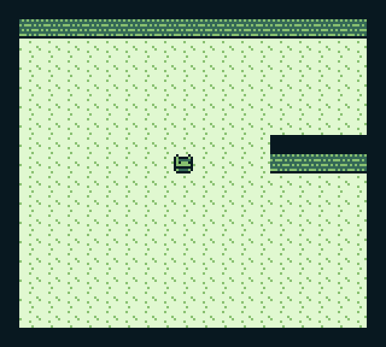
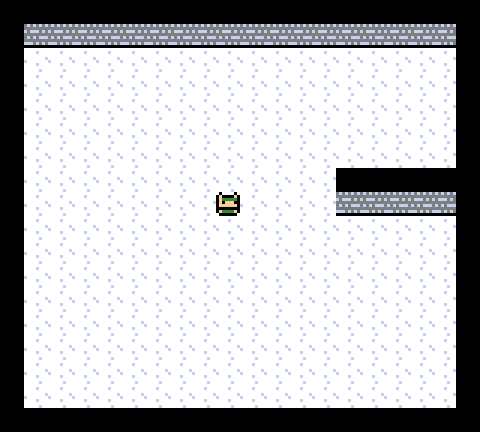
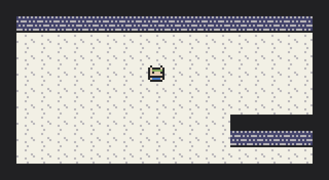
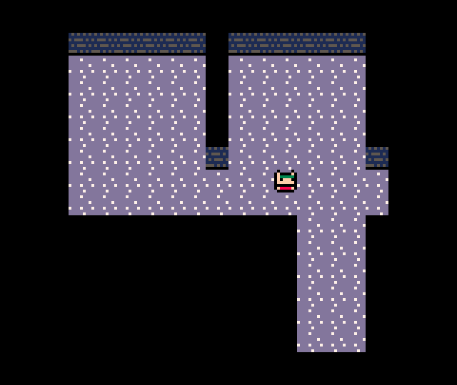

# Welcome to the blog!

Hey all, welcome to my little game dev blogging project. I don't really know how to start things off so I guess I'll just explain what exactly I'm doing here.

I'm working on a small turn-based game that I want to try and develop for as many different platforms as I can. As of writing this post, I have made a start on versions of the code for desktop platforms as well as PICO-8 and the Nintendo Gameboy. Each of these versions will be coded separately, but offer a similar experience tailored slightly to fit each one.

## Why?

For fun! Ever since I started learning how to code for the Gameboy, I've had this mild fascination with trying to write a series of games that functions across the entire Nintendo handheld lineup - Gameboy, Gameboy Colour, Gameboy Advance, DS, and 3DS. It's a task which I consider to be all-around infeasible and impractical and yet still sounds really cool. So I decided to just start coding something and see where I end up.

The likely outcome of all this is that I will make some progress, learn a few things, and then give up or get bored of it at some stage. Having started on 3 separate versions of the game already, I can already say that trying to make even the tiniest of demos in three separate codebases is a fair bit of work. If I'm to add more platforms as I go along, each with their own codebase, that amount of work will increase rapidly.

## Separate codebases for each platform? Sounds crazy

It is. The sensible thing to do would be to write the game *once* in a language that I can port to as many platforms as possible. This would at least be feasible for platforms like the DS/3DS, desktop, and web clients. But it so happens that I am also fascinated with coding across different languages, and so for me this resembles an opportunity to force myself to work in multiple languages despite the lack of necessity. Even this blog is, in a sense, an excuse to stretch my mind in a different direction whilst staying within the confines of one distinct project.

So, the Gameboy version of the game is being written in assembly, the desktop version of the game is being written in Rust, and the PICO-8 version is being written in Lua. As I add more, I expect to branch out to more languages such as C for the Gameboy Advance, probably C++ for the DS version, and maybe I'll find an excuse to throw in some Go somewhere.

## Ok, can we see the game?

What little that exists of it, yes. Right now I have an example screen displaying a room and a little character. I haven't even finished adding movement yet! But here, have some screenshots of what exists so far:

The idea is to use the same art style across all versions while adapting the palette to each one. So I'll make the art assets for the Gameboy first (as that is the most constrained) and then colourise them across the others in whatever fashion looks nice to me. Each platform will also be an opportunity to give the art a different flavour with colours unique to each.

## What's the plan from here?

Well right now I have grid-based movement working in the PICO-8 version (which is by far the easiest one to hash out ideas in), and am currently working on adding it to the desktop version as well (which is taking a bit because my experience with Rust is very minimal). After that, the assembly code for the Gameboy version should be an interesting affair. Oh, and meanwhile I'm trying to learn about writing games for the Gameboy Advance, so once I have a modicum of understanding about that, I may start adding a version for that also.

So with any luck I'll keep plugging away at coding these different versions and as I do, I'll post some updates about how things are going or anything that I deem to be interesting. Or, maybe this will be the only post I ever write for the project! Who knows :)