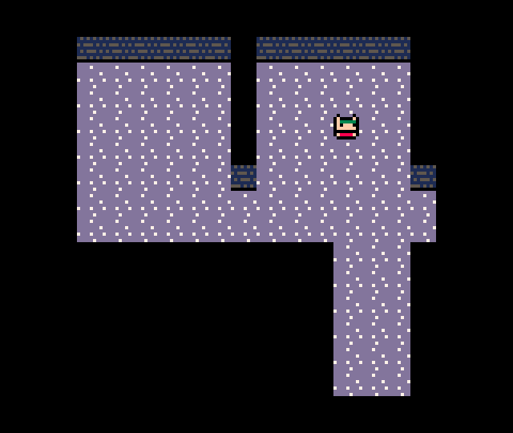

# Lua Code Walkthrough

As I go through each stage of building out the game, I think it would be interesting to discuss the state of the code, and so this end today I will give a quick walkthrough of how the Lua code for the [PICO-8](https://www.lexaloffle.com/pico-8.php) version looks so far. It's easily the simplest implementation, so it makes a good starting point. At the time of writing, all you can do is move a character around the screen, so there is also not too much code to discuss so far.



## Core

Let's first take a look at the core PICO-8 entry points for the game:

```lua
function _init()
 palt(0,false)
 palt(14,true)
 state={
  update=update_game,
  draw=draw_game
 }
 globalstate={
  player={
   x=3,
   y=3,
   sx=3*8,
   sy=3*8,
   getcmd=player_control,
  }
 }
end

function update_game(gs)
 if(cmd==nil)then
  cmd=gs.player.getcmd(gs.player)
 end
 if(cmd!=nil)then
  done=cmd(gs.player)
  if(done)cmd=nil
 end
end

function draw_game(gs)
 cls()
 map(0,0,0,0,16,16)
 spr(1,gs.player.sx,gs.player.sy)
end

function _update60()
 state.update(globalstate)
end

function _draw()
 state.draw(globalstate)
end
```

These contain the basic setup for the game's data as well as the core update/draw loop. I have introduced a basic `state` abstraction which the `_update` and `_draw` functions defer to in preparation to have multiple separate states that manage the game, e.g. menu state, an exploring state, a battle state, etc. I won't be going the whole hog and writing any kind of state-machine for this - probably just a basic series of if statements to run whichever state is appropriate for what the game is doing at any point in time. For now though it is just a little bit of low-cost indirection that I expect I will need in the future.

The `draw_game` function, taking the current 'global state' `gs` which I expect to contain all of the core game data, is very simple - just draws the current map data and player sprite to the screen using PICO-8's inbuilt functions.

The `update_game` implementation utilises a very basic [command pattern](https://en.wikipedia.org/wiki/Command_pattern) that should prove useful when I add enemies into the mix later on. Each unit on the map - currently, only the player - is designated a controller via the `getcmd` property which can be used to figure out what that unit should do next. For the player, this will be determined by player input (shown later), and for enemies some kind of AI. Commands may operate over the span of multiple frames, so rather than running the command only once, we continue to execute it once per frame, and once it is done, we will pick up a new one. In this way, we can cycle through units on the map letting them act in a turn-based manner (even though there is only the player right now).

One thing you will probably notice is that the code is as brief as possible, with unclear names used in some cases. This is mainly due to the constrained screen size when coding in PICO-8, for which I opt to keep variable names small where feasible. Since I intend to keep this version of the code quite simple into the future, hopefully it will not become too much of a readability issue later on.

## Player control

Now let's look at the player controller that issues commands for the player's unit:

```lua
function solid(x,y)
 return mget(x,y)!=3
end

function player_control(p)
 if(btnp(0) and not solid(p.x-1,p.y))then
  return moveleft
 end
 if(btnp(1) and not solid(p.x+1,p.y))then
  return moveright
 end
 if(btnp(2) and not solid(p.x,p.y-1))then
  return moveup
 end
 if(btnp(3) and not solid(p.x,p.y+1))then
  return movedown
 end
 
 return nil
end
```

This just reads the current input for PICO-8's directional buttons 0 through 3 with some collision checking against the PICO-8 tilemap. If the player isn't pressing anything, `nil` is returned, which will signal the update loop to wait until the next frame to check again (so the game is effectively paused until the player presses an arrow key).

The actual commands themselves are what drive the movement:

```lua
function sign(x)
 if(x==0)return 0
 return sgn(x)
end

function generic_move(u,dx,dy)
 local tx=(u.x+dx)*8
 local ty=(u.y+dy)*8
 
 u.sx+=2*sign(dx)
 u.sy+=2*sign(dy)
 
 if(u.sx==tx and u.sy==ty)then
  u.x+=dx
  u.y+=dy
  return true
 end
 
 return false
end

function moveleft(u)
 return generic_move(u,-1,0)
end
function moveright(u)
 return generic_move(u,1,0)
end
function moveup(u)
 return generic_move(u,0,-1)
end
function movedown(u)
 return generic_move(u,0,1)
end
```

Each command is just a function that takes as argument the unit that it should be operating on, so that the commands that drive the player can also be used on enemies and vice versa. Since the movement commands are all very similar, they all just defer to one function that handles movement in the x/y directions.

The main confusing thing for the movement commands is the existence of both `x/y` and `sx/sy` on a unit. The first of these are used to store the unit's x/y position in tilemap co-ordinates, whereas the latter refers to the unit's *screen* co-ordinates. Since the movement commands slowly move the unit across the screen a few pixels at a time rather than moving an entire grid cell in one frame (creating a smoother animation), these two different co-ordinates can vary from each other. So in most cases for game logic we will be using the grid co-ordinates, whereas the screen co-ordinates can be used for animations.

The `sign` function exists as an alternative to PICO-8's `sgn` function, since I want it to return 0 when 0 is passed instead of 1.

## Conclusion

That's it for the Lua code so far! Thanks to PICO-8's ease-of-use, it doesn't take much code to get a very basic concept up and running. The future code walkthroughs might need to be more detailed as I try to detail the Rust implementation or, dare I attempt it, the assembly implementation...