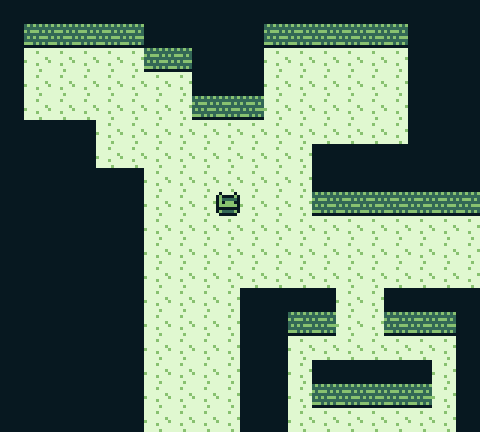
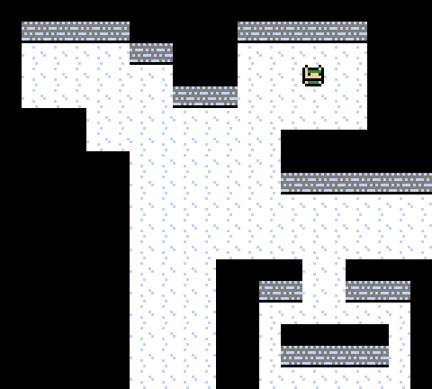
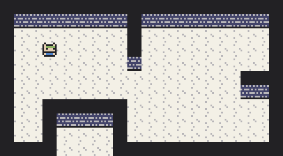
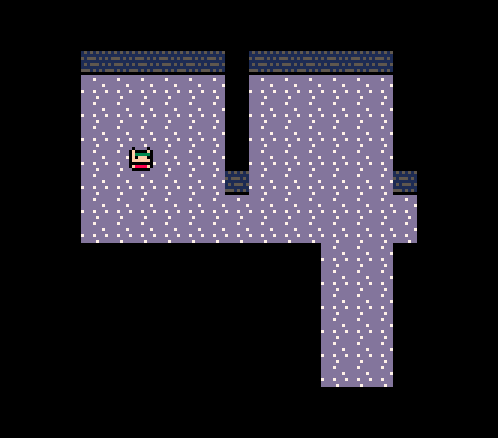

# Basic Movement Complete

As of today, I've got basic movement and collision detection working in three versions of tbg! It's a small start to be sure, but it's been fun and exciting implementing the groundwork for this across three separate languages with subtly different requirements and setups for each one. (It might not *sound* fun and exciting, but for whatever reason, it has been for me)

Let's check it out in action! Here's the Gameboy version (colour and monochrome):

 

Now for the desktop version:

And the PICO-8 version!

## Thoughts on moving between languages

When adding movement to the static sprite display I had previously, my ordering went from PICO-8 > PC > Gameboy. I think this worked quite well for me for a few reasons. First of all, since PICO-8 is a platform expressly designed for rapid development and ease of prototyping, it makes a really good starting point to flesh out how I want something to work before having to commit to any kind of rigid structure. This was especially helpful as I worked my way down to assembly language for the Gameboy, since I already had a developed mental model for the code that I could focus on translating into assembly language, rather than trying to develop the model and assembly in tandem which I find extra difficult since my assembly skills are still fairly under-developed.

One interesting thing I noticed about going from Lua to Rust to assembly language was the transition from dynamic typing to static typing to... no typing at all! We typically think that the more low-level you go, the more strict a language is. But in assembly, since you're dealing with raw bytes in memory, you're almost as free as you are in Lua to just do what works for you without any regard for types or variable scoping! I just found it funny that of the three languages, Rust is the one I struggled most with rather than assembly, not only because I am very new to the language, but because I had to spend the extra time dealing with static typing and compiler errors. It just goes to show that as much as I *love* strongly-typed language on any regular day, this always comes with the overhead of jumping through the occasional compiler hoops to make sure your program is valid, especially for a language that places as much emphasis on compile-time checks as Rust does.

## Differences in implementation

Functionality-wise, the implementations are more-or-less identical barring some subtle differences in behaviour, since I chose to focus on doing what was most convenient in each language rather than aiming for each to be an exact replica of the others. One key difference between them is how I manage the tilemap creation. In PICO-8, all of the tilemapping is in-built, so creating and rendering the map is all native to the system. In Rust, which is using [Raylib](https://www.raylib.com/), there were no native tilemapping functions that I could see, so I had to put together some functionality for loading/drawing tilemaps myself using maps that I would create in [Tiled](https://www.mapeditor.org/) and export to CSV. For Gameboy, tilemap generation is quite handily provided by the [RGBDS toolchain](https://rgbds.gbdev.io/), but to help make the mapping a bit easier I did set up a tilemap in Tiled which I can export to image to be converted to the Gameboy format by `rgbgfx`.

As I go on to implement more things across each version, I am keen to see how the tooling for each platform might diverge and how I can create the same functionality using what is most convenient for each.

## What's next?

I'm not entirely sure what aspect of the implementation I will work on next, but here's a few things I am thinking about:

- Adding enemies with basic AI (this will help pave the way for a battle system)
- Expanding the game's tilemap either by splitting the world into different rooms or having a scrolling camera
- Testing out 16x16 sprite sizes on Gameboy to account for the small screen size

I'm also really keen to start learning more about GBA development so that I can start on a GBA version of the game, but so far my priority has been on working with the platforms I already know - so we'll see if I can allocate the time to bone up on all the GBA reading I need to do 😅